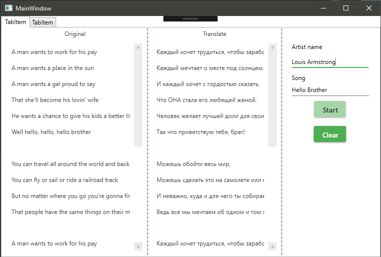

# AmalgamaParser
Приложение создана на WPF, с использованием Material Design Theme(https://github.com/ButchersBoy/MaterialDesignInXamlToolkit). Для парсинга текста песен с сайта Amalgama, используется библиотека AngleSharp.
## View

