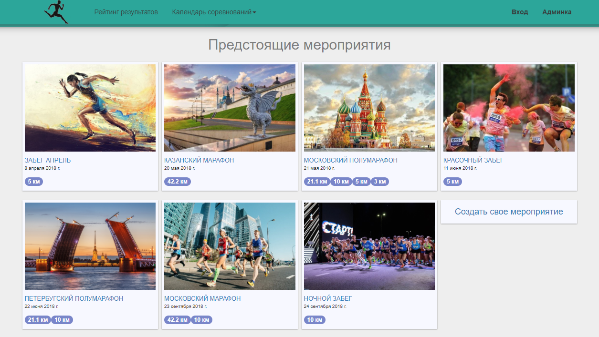
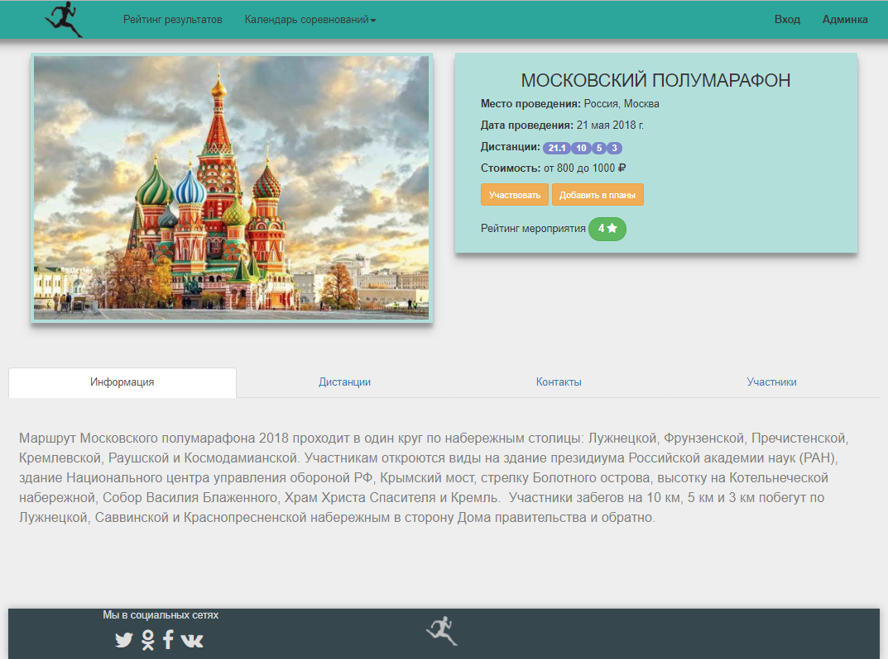
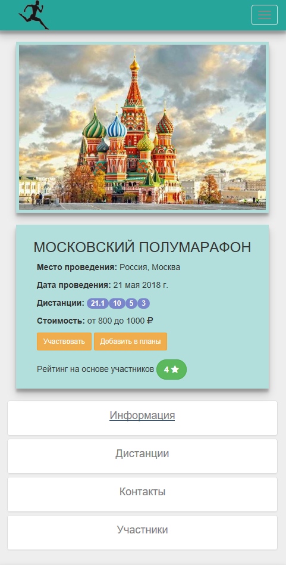

# Athletics

Веб-приложение создано на фреймворке Vue.js (так же использовался vue-router, vuex, bootstrap 3). В серверной части испоьзуется node.js, espress, mysql. 
Тестовая версия развернута на microsoft azure: https://athleticsapps.azurewebsites.net/

Над приложением работаю меньше месяца, поэтому функционал пока что не большой.
В данный момент приложение позволяет:
```
-просматривать информацию о прошедшиб и предстоящих беговых мероприятия;
-добавлять мероприятие;
-искать мероприятие по названию;
-просматривать таблицу результатов;
-искать результаты по фамилии и имени;
-просматривать профили пользователей;

```
Планирую в ближайший месяц:
```
-доработать форму добавления мероприятий(сейчас она уже работает);
-добавить регистрацию;
-сделать функцию добавления мероприятия в планы;
-добавить возможность загрузки результатов;
-подправить визуальные проблемы приложения
```
## View






## Build Setup

``` bash
# install dependencies
npm install

# serve with hot reload at localhost:8080
npm run dev

```

For detailed explanation on how things work, consult the [docs for vue-loader](http://vuejs.github.io/vue-loader).
