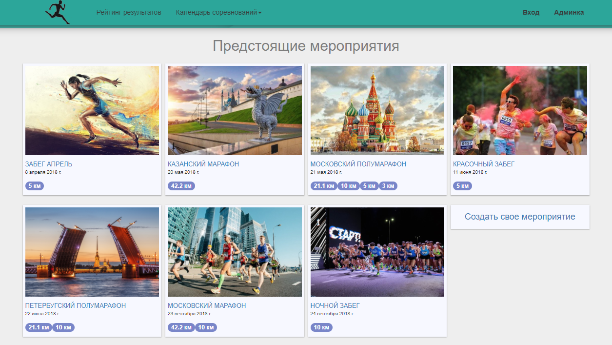
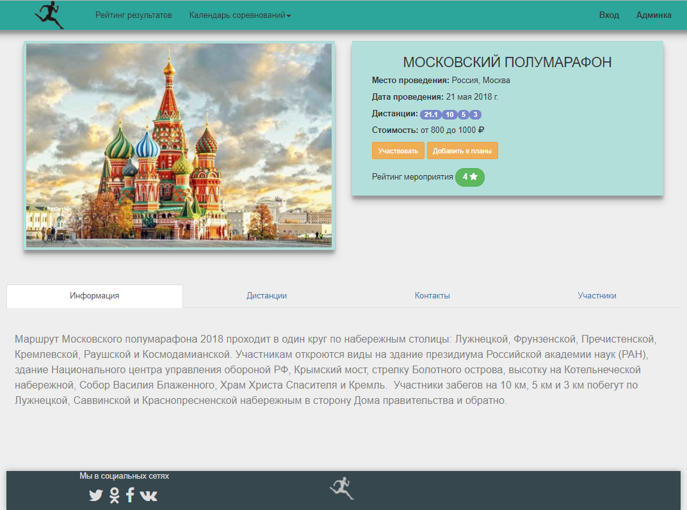
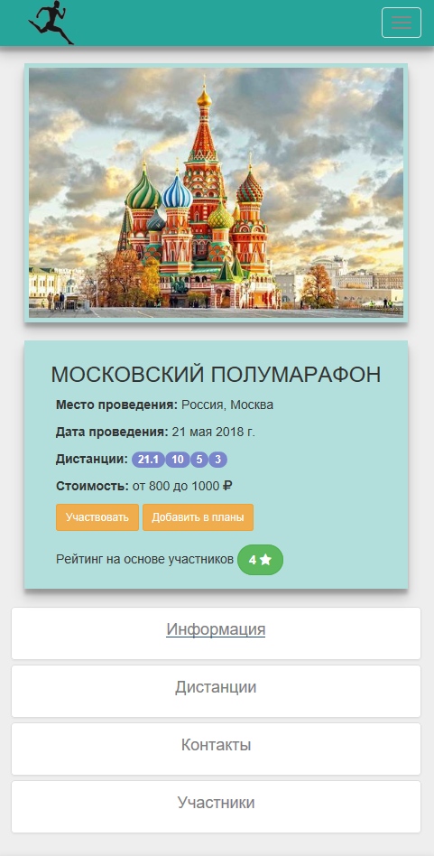

# Athletics

Веб-приложение создано на фреймворке Vue.js (так же использовался vue-router, vuex, bootstrap 3). В серверной части испоьзуется node.js, express, mysql. 
Тестовая версия развернута на microsoft azure: https://athleticsapps.azurewebsites.net/
```
## View






## Build Setup

``` bash
# install dependencies
npm install

# serve with hot reload at localhost:8080
npm run dev

```

For detailed explanation on how things work, consult the [docs for vue-loader](http://vuejs.github.io/vue-loader).
