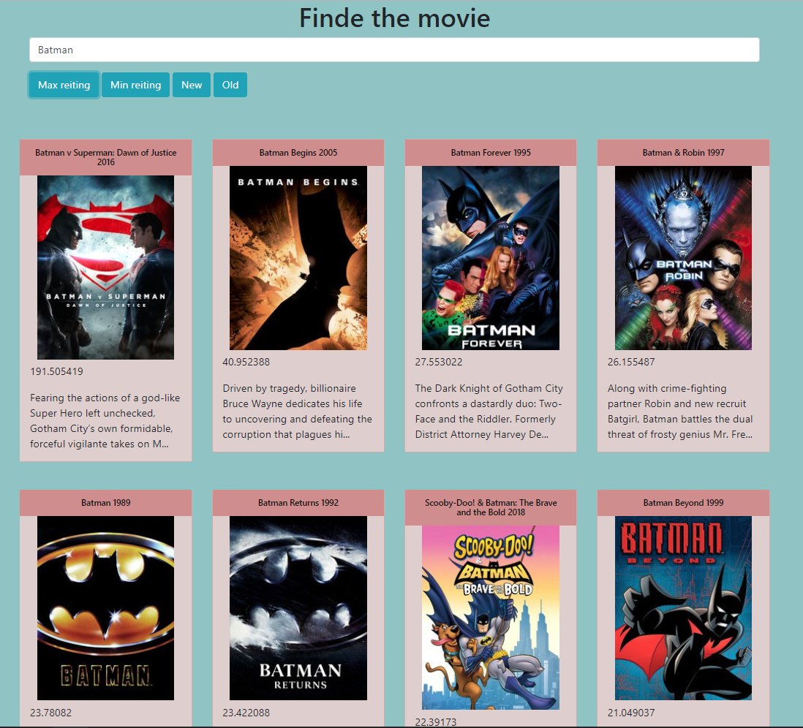

# findMovie
Приложение для поиска фильмов с использованием сторонего API (https://api.themoviedb.org). Создано на чистом JS в учебных целях для понимания fetch, классов и разбивки на модули(export, import). Приложение функциональностью не блещет: на каждый ввод в строку поиска ищет фильм с подходящим названием, и выводит краткую информацию о нем, при на жатии фильм, переходит на страницу с более полной информацией(но эту функцию еще дорабатываю). Развернуто на google.firebase, вот ссылка на разыернутую версию: https://findfilm-ffbd.firebaseapp.com/ 

## View

