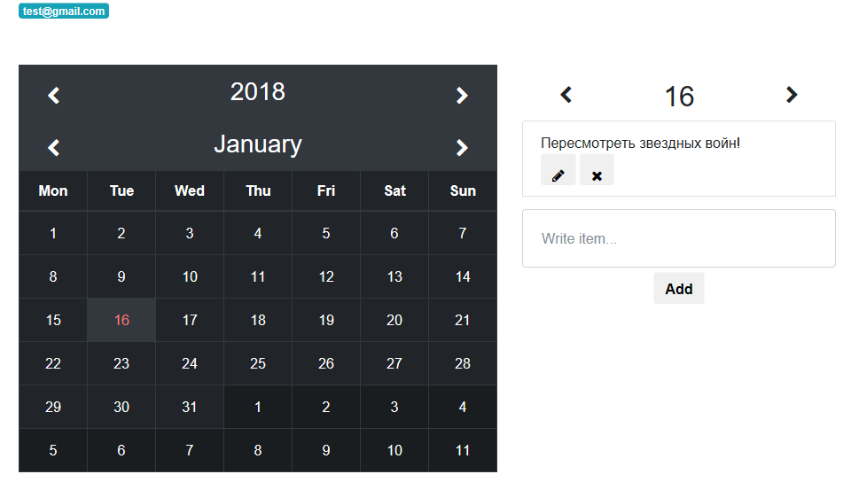

# organizer

Приложение создан с помощью фреймворка Vue.js, для регистрации и хранение записей используется google.firebase. Вот ссылка на развернутую версию https://organizer-89776.firebaseapp.com/
Приложение позволяет выбрать любую дату (для этого создан мини календарик), и оставить заметку, так же эти заметки можно удалять и редактировать. Оставлять записи можно только после регистрации! Если лень регистрироваться, вот имя и пароль тестового пользователя: test@gmail.com, testing1234 

## View



## Build Setup

``` bash
# install dependencies
npm install

# serve with hot reload at localhost:8080
npm run dev

# build for production with minification
npm run build
```

For detailed explanation on how things work, consult the [docs for vue-loader](http://vuejs.github.io/vue-loader).
