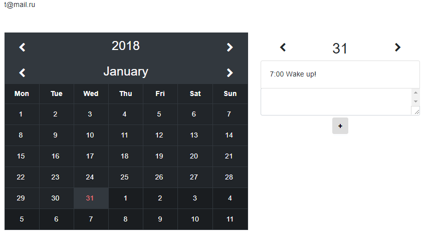

# organizer

Проект создан с помощью фреймворка Vue.js, для регистрации и хранение записей используется google.firebase. Вот ссылка на развернутую версию https://organizer-89776.firebaseapp.com/

##
Проект размещен на google.firebase 
> https://organizer-89776.firebaseapp.com/

## View



## Build Setup

``` bash
# install dependencies
npm install

# serve with hot reload at localhost:8080
npm run dev

# build for production with minification
npm run build
```

For detailed explanation on how things work, consult the [docs for vue-loader](http://vuejs.github.io/vue-loader).
